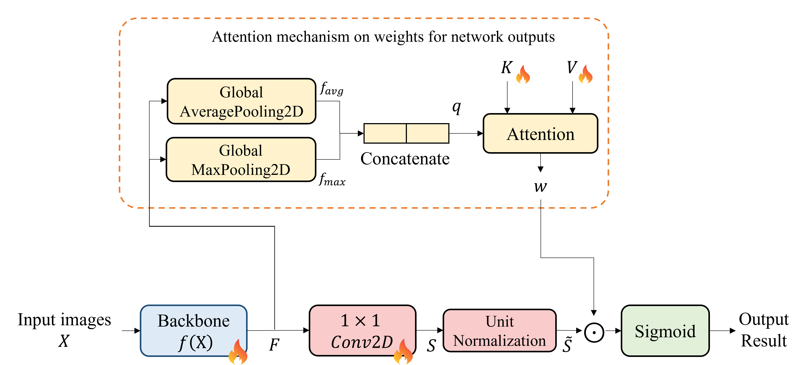
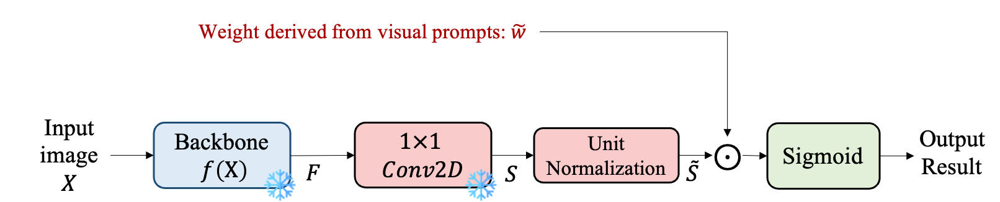
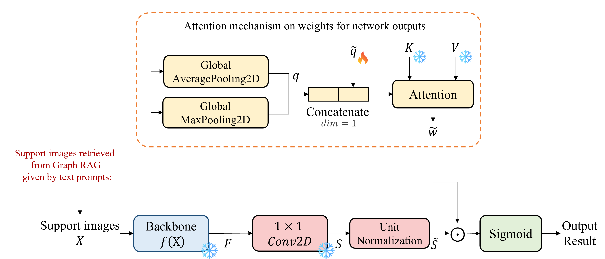

# Few-Shot Feeding-Splash Semantic Segmentation Using Text- and Vision-Based Prompts

Lightweight semantic segmentation for **fish feeding-splash detection** in aquaculture. The model adapts to unseen farms without retraining the backbone: a frozen SegFormer-B0 encoder plus environment-adaptive channel weights, driven by **context attention**, **text prompts (Graph RAG + prompt tuning)**, or **visual prompts (MIL)**.

This repository contains the implementation of the master’s thesis:

> Chen-Huan Kao. *Few-Shot Feeding-Splash Semantic Segmentation Using Text- and Vision-Based Prompts*. Department of Computer Science and Engineering, National Taiwan Ocean University. Advisor: Chin-Chun Chang.

**Author:** Chen-Huan Kao  
**Affiliation:** National Taiwan Ocean University (NTOU)

---

## Why this problem

Vision-based splash detection can optimize feeding cycles and cut operating cost. In practice, ponds, indoor tanks, and offshore cages differ in water color, lighting, facility structure, and fish species. A model trained on a few sites often fails on a new farm—especially on edge devices—while collecting and labeling a new dataset for every site is expensive.

This project treats that domain shift as a **few-shot, prompt-driven rebalancing** problem: keep a tiny frozen backbone, and only update (or algebraically solve for) a low-dimensional channel-weight vector.

On a 3×512×512 input, the proposed network (`MCA`) is about **3.74M parameters / 14.06 GFLOPs**, versus hundreds of millions of parameters and tens of thousands of GFLOPs for a generalist such as SAM 3.

---

## Method (what is original here)

The encoder–decoder skeleton is SegFormer (MiT-B0 + All-MLP fusion). Everything below is the thesis contribution: a **unified subclass head**, three adaptation routes that share the same weight interface, and a Visual Graph RAG engine for text.

The three figures below are the same unified network as in the thesis (Figure 3): one forward pass, three ways to obtain the environment-adaptive channel weight.

<p align="center">
  
</p>
<p align="center"><em>(a) Computational flow without support — global context attention (<code>M<sub>CA</sub></code>).</em></p>

<p align="center">
  
</p>
<p align="center"><em>(b) Computational flow with visual prompts — point / box / mask MIL bags (<code>M<sub>VP</sub></code>).</em></p>

<p align="center">
  
</p>
<p align="center"><em>(c) Computational flow with text prompts — Graph RAG support set and prompt tuning of <code>q̃</code>, <code>γ</code> (<code>M<sub>TP</sub></code>).</em></p>

<p align="center"><strong>Unified architecture.</strong> The Mix Transformer encoder and All-MLP fusion are shared. Only the weight path changes with the prompt source.</p>

### 1. Context attention (`MCA`)

A global query `q` is pooled from the fused map and matched against a learned field knowledge base: keys `K ∈ R^{K×2d}` and values `V ∈ R^{C×K}` (`K = 5` base environments). Softmax attention over `K` produces a scene-specific channel weight `w`. No user prompt is required.

### 2. Visual prompting (`MVP`) — multiple-instance learning

Point, box, or mask cues are turned into **positive / negative instance bags** in the normalized subclass space:

| Prompt | Positive bag | Negative bag |
|--------|----------------|--------------|
| Point | 7×7 neighborhood around splash clicks | 7×7 around background clicks |
| Box | pixels inside the ROI | equal-count samples outside the box |
| Mask | pixels inside the contour | equal-count samples outside the contour |

Shared background patterns cancel in the mean-difference `d = μ_P − μ_N`. Weights are obtained either by:

- **Magnitude-constrained difference:** scale `d / ‖d‖` by the mean L2 norm of columns of `V`
- **Linear programming in the learned subspace:** `w̃ = Vα` with `α` on the simplex, maximizing `dᵀ w̃`

The backbone stays frozen; only `w̃` changes.

### 3. Textual prompting (`MTP`) — Graph RAG + prompt tuning

Natural language (species, field, water color, splash shape, intensity, …) does **not** enter the vision backbone as CLIP-style embeddings. Instead:

1. An LLM maps the sentence to a **schema-constrained JSON intent** (Ollama, default `llama3:8b`).
2. A rule-based backend builds a **Cypher** query (no free-form LLM Cypher).
3. Neo4j retrieves matching visual clusters; a **field-proportional stratified sampler** builds a balanced support set (default 20 images, intensity quartiles for high/low).
4. Only the soft prompt `q̃` and blend coefficient `γ` are tuned. Final weights mix the visual query `q` and the textual prior `q̃`.

This is parameter-isolated: base-environment knowledge in `K, V` is not overwritten.

### Graph construction (offline)

Splash pixels are GAP-pooled to 256-D vectors, L2-normalized, and clustered (K-Means; `K` by silhouette). Clusters are annotated with expert metadata and a VLM, then stored as a graph: Cluster, Field, Environment, FishSpecies, plus visual attributes (water color, texture, splash shape, lighting, interference, …). Species intensity ranks support comparative queries (e.g. cobia vs. fry). New farms can attach to an existing cluster or spawn a node via cosine-similarity routing.

<p align="center">
  
</p>
<p align="center"><em>Offline ingestion: 256-D splash features → clustering → VLM / expert attributes → Neo4j knowledge graph.</em></p>

<p align="center">
  
</p>
<p align="center"><em>Retrieval example: a natural-language query is parsed to JSON intent, executed as Cypher, and packed into a field-balanced prompt bag.</em></p>

---

## Experimental setting (from the thesis)

**Hardware:** AMD Ryzen 9 9900X, 64 GB RAM, NVIDIA RTX 5090 (32 GB).

**Base environments A–E** (500 images each) are used for training/testing without domain shift. **Unseen F–J** evaluate transfer. Knowledge about F–J lives in the graph so Graph RAG can still retrieve a support set; those images are **not** used to train the backbone.

| Env | Type | Species | Images |
|-----|------|---------|--------|
| A | Outdoor small tank | Black seabream | 500 |
| B | Offshore cage | Cobia | 500 |
| C | Indoor tank | Hybrid rock bream | 500 |
| D | Land-based pond | Seabass | 500 |
| E | Land-based pond | Fourfinger threadfin | 500 |
| F | Offshore cage | Pompano | 182 |
| G | Land-based pond | Black seabream | 107 |
| H–J | Offshore cage | Cobia | 131 / 118 / 160 |

**Comparisons** include U-Net, DeepLabv3+, SegFormer-B0/B1, MaskFormer / Mask2Former (Swin-T), and SAM 3. Transformers beat CNNs on this texture-heavy task. Under strong shift (especially H–I), large models’ median IoU can collapse below 20%; SAM 3 with a generic “splashes” prompt also fails on this domain. The proposed prompts mainly **raise the lower bound** (worst-case IoU), which matters more than a small gain in the mean for edge deployment.

Code configs map fields as: `A=barrel`, `B=sea`, `C=LNG`, `D=seabass_hmh`, `E=noon_jsj`. Unseen keys `F`–`L` are listed under `DATASET.UNSEEN_DOMAINS`.

---

## Repository layout

This snapshot is a **code-and-method** release. Trained weights, inference dumps, and most raw images are omitted on purpose (size, privacy, and a cleaner skill demo).

```
arch_attention.png          # Fig. 3(a) context attention
arch_visual.png             # Fig. 3(b) visual prompts (MIL)
arch_text.png               # Fig. 3(c) text prompts (Q-prime)
graph_rag_pipeline.png      # Fig. 5 offline Graph RAG ingestion
graph_rag_pipeline_3.png    # Fig. 7 retrieval example
configs/                    # YAML for training and few-shot inference
semseg/                     # Training framework + models
  models/
    subclass_segformer_unified.py   # Unified SegFormer-B0 + subclass head
    heads/subclass.py               # MCA / MIL / Q-prime (q̃, γ) head
    backbones/mit.py                # Mix Transformer (upstream)
Subclass/                   # Thesis pipelines (start here)
  train_unified.py          # Stage-1 training on base fields
  val_unified.py
  unified_pipeline.py       # baseline | mil | qprime inference
  mil_pipeline.py           # Point / box / mask → w̃
  qprime_pipeline.py        # Freeze backbone; tune q̃ and γ
  dataset.py                # RippleDataset / RippleFeatureDataset
  prompt/                   # Visual Graph RAG
    core_pipeline.py        # Intent parse → Cypher → prompt bag
    GraphRAG.py             # Cluster, VLM drafts, GML graph
    import_gml_to_neo4j.py
    vlm_knowledge_construction_v3/   # Cluster JSON + knowledge_graph.gml
  case_study/               # Extra sites / SegFormer-B0 vs B1
tools/                      # Upstream train / val / infer / export
```

Upstream training utilities (`tools/`, extra backbones/heads, ADE20K-style configs) remain from the original semantic-segmentation project and are **not** the thesis deliverable.

---

## Environment

- Python ≥ 3.8  
- PyTorch ≥ 1.8 (CUDA recommended)  
- Optional for text prompts: [Ollama](https://ollama.com/) (`llama3:8b`) and [Neo4j](https://neo4j.com/) (`bolt://localhost:7687`)

```bash
git clone <this-repo>
cd subclass_segformer
pip install -r requirements.txt
pip install neo4j networkx requests   # Graph RAG only
```

Place ImageNet-pretrained MiT-B0 weights (from the SegFormer release) at the path in `configs/ripple_prompt_stage1.yaml` (`MODEL.PRETRAINED`).

Edit YAML paths before running. `DATASET.ROOT`, `LIST_DIR`, `UNSEEN_DOMAINS`, and Graph RAG JSON paths were written for a local Windows machine; they are placeholders in this snapshot.

---

## Data format

Base-field layout expected by `RippleDataset`:

```
<DATASET.ROOT>/
  barrel|sea|LNG|seabass_hmh|noon_jsj/
    fold_1 … fold_4/
      images/*.png|*.jpg
      labels/                 # pixel masks, splash = class 1
```

Unseen domains are listed in `UNSEEN_DOMAINS` as `field_id: <label_or_image_root>`. Few-shot support / exclude lists live under `DATASET.LIST_DIR`.

The aquaculture images themselves are **not** bundled.

---

## Training (Stage 1)

Train the unified model on base fields A–E. `q_prime` is frozen; the encoder, fusion MLP, subclass map, and `(K, V)` attention are learned.

```bash
python Subclass/train_unified.py --cfg configs/ripple_prompt_stage1.yaml --k 0
```

`--k` holds out fold `k+1` when building the 4-fold split. Default: 300 epochs, AdamW `1e-4`, image size 800×800, batch size 5, Focal/NLL losses as set in YAML.

After training, point `MODEL.PRETRAINED` / `EVAL.MODEL_PATH` in `configs/ripple_prompt.yaml` at the saved checkpoint.

---

## Inference and few-shot adaptation

Entry point: `Subclass/unified_pipeline.py`.

```bash
# Autonomous context attention (MCA)
python Subclass/unified_pipeline.py --cfg configs/ripple_prompt.yaml --field F --method baseline

# Visual prompt (MVP): box | point | mask
python Subclass/unified_pipeline.py --cfg configs/ripple_prompt.yaml \
  --field F --method mil --mil_method box --need_negative

# Text prompt (MTP): Graph RAG + Q-prime tuning
python Subclass/unified_pipeline.py --cfg configs/ripple_prompt.yaml \
  --field F --method qprime \
  --text_prompt "Find strong splash patterns for Golden Pomfret in offshore cages"
```

`--field` is an unseen key (`F`–`L`) or a base field name. Metrics (`IoU`, `Precision`) are written under `Subclass/unified_npy/`. If Graph RAG returns an empty bag, Q-prime **falls back to baseline**.

MIL weights are computed offline from support images and cached under `Subclass/cache/`. Diagnostics (`--enable_diagnostics`) dump hard examples and overlay plots.

### Graph RAG only

```python
from Subclass.prompt.core_pipeline import AquacultureGraphRAG

rag = AquacultureGraphRAG(
    pt_mapping_path="Subclass/prompt/vlm_knowledge_construction_v3/pt_to_cluster_mapping.json",
    knowledge_json_path="Subclass/prompt/vlm_knowledge_construction_v3/cluster_knowledge_final.json",
    neo4j_pw="your_neo4j_password",
)
result = rag.query(text_prompt="Find strong splash patterns in Field B", total_n=20)
print(result["image_list"], result["intent"])
```

Rebuild the graph: cluster 256-D splash features → VLM-fill cluster JSON → `knowledge_graph.gml` → `Subclass/prompt/import_gml_to_neo4j.py`. Step-by-step notes: [Subclass/prompt/README.md](Subclass/prompt/README.md).

---

## Implementation map

| Paper component | Code |
|-----------------|------|
| Unified network | `semseg/models/subclass_segformer_unified.py` |
| Subclass head, `q̃`, `γ`, `(K, V)` | `semseg/models/heads/subclass.py` (`SubclassBlock_Unified`, `SubclassSegFormerHead_Unified`) |
| Stage-1 training | `Subclass/train_unified.py` |
| MIL bags and `w̃` | `Subclass/mil_pipeline.py` |
| Prompt tuning | `Subclass/qprime_pipeline.py` |
| Graph RAG | `Subclass/prompt/core_pipeline.py` |
| Orchestration | `Subclass/unified_pipeline.py` |

---

## What this snapshot does not include

- Trained `.pth` checkpoints and ImageNet MiT weights  
- Raw farm videos / full image datasets  
- Cached MIL weights, TensorBoard logs, and dense prediction folders  

Configs and Graph RAG JSON/GML remain so the **method and engineering** can be read without the large artifacts.

---

## Upstream framework

Training loops, Mix Transformer, YAML tooling, and generic dataset loaders are adapted from:

**[sithu31296/semantic-segmentation](https://github.com/sithu31296/semantic-segmentation)** (MIT License; see [LICENSE](LICENSE)).

That project is a general PyTorch segmentation toolbox. This repository uses it as a **starting scaffold**. The feeding-splash task, unified subclass decoder, context attention, MIL visual prompts, Graph RAG, Q-prime tuning, and all aquaculture experiments are original work for the thesis above.

---

## Citation

If you use this code or the method, please cite the thesis:

```bibtex
@mastersthesis{kao2027feedingsplash,
  title     = {Few-Shot Feeding-Splash Semantic Segmentation Using Text- and Vision-Based Prompts},
  author    = {Kao, Chen-Huan},
  school    = {National Taiwan Ocean University},
  year      = {2027},
  month     = {5},
  address   = {Keelung, Taiwan},
  note      = {Advisor: Chin-Chun Chang}
}
```

SegFormer (backbone design):

```bibtex
@article{xie2021segformer,
  title   = {SegFormer: Simple and Efficient Design for Semantic Segmentation with Transformers},
  author  = {Xie, Enze and Wang, Wenhai and Yu, Zhiding and Anandkumar, Anima and Alvarez, Jose M and Luo, Ping},
  journal = {arXiv preprint arXiv:2105.15203},
  year    = {2021}
}
```
