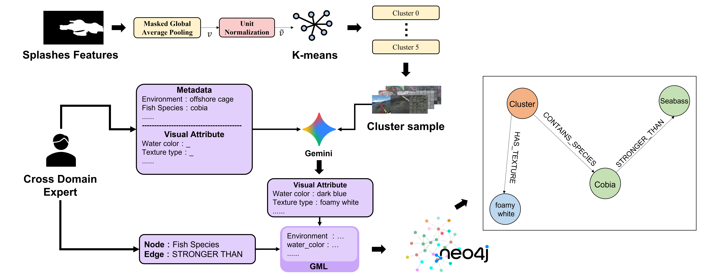
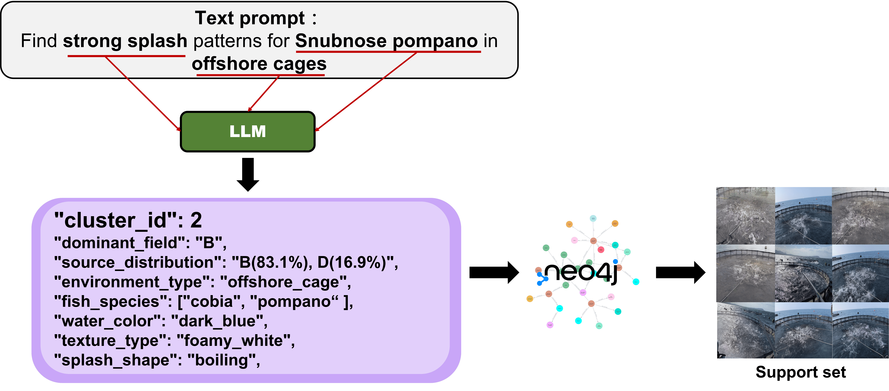

# Prompt Module — Graph RAG Knowledge Construction and Text-Prompt Retrieval

This folder implements the **Aquaculture Graph RAG** pipeline that backs Q-prime (textual) inference. Splash features in 256-D are clustered, labeled with a vision-language model (VLM), stored in Neo4j, and retrieved as a **prompt bag** when the user types a natural-language query. `unified_pipeline.py` then prompt-tunes `q̃` and `γ` on that bag.

<p align="center">
  
</p>
<p align="center"><em>Offline ingestion pipeline of the Visual Graph RAG engine (thesis Figure 5).</em></p>

<p align="center">
  
</p>
<p align="center"><em>Retrieval example: text → structured intent → Cypher → stratified prompt bag (thesis Figure 7).</em></p>

---

## Pipeline

```
256-D features (.pt)
    │
    ▼
K-Means clustering (GraphRAG.py)
    │
    ├── prompt_256D/              cluster labels, medoids, priors
    │
    ▼
VLM visual annotation (Gemini / manual)
    │
    ├── vlm_knowledge_construction_v3/
    │     cluster_knowledge_draft.json   → annotation draft
    │     cluster_knowledge_filled.json  → VLM-filled attributes
    │     cluster_knowledge_final.json   → merged graph_rag fields
    │     pt_to_cluster_mapping.json     → feature ↔ cluster ↔ image
    │     knowledge_graph.gml            → NetworkX graph
    │
    ▼
Neo4j import (import_gml_to_neo4j.py)
    │
    ▼
Text query → LLM intent parse → Cypher retrieve → prompt bag
    │
    ▼
core_pipeline.py (AquacultureGraphRAG)
    │
    ▼
unified_pipeline.py (Q-prime tuning + inference)
```

---

## Directory layout

```
prompt/
├── core_pipeline.py              # Graph RAG entry point (external API)
├── GraphRAG.py                   # Full knowledge-construction script (exported from the notebook)
├── GraphRAG.ipynb                # Interactive construction notebook
├── import_gml_to_neo4j.py        # GML → Neo4j importer
│
├── prompt_256D/                  # K-Means outputs
│   ├── visual_bases_K{n}_medoid.pth
│   ├── priors_K{n}.pth
│   ├── kmeans_labels.base_npy
│   └── best_representative_images.json
│
├── vlm_knowledge_construction_v3/  # Primary knowledge base (v3)
│   ├── cluster_knowledge_draft.json
│   ├── cluster_knowledge_filled.json
│   ├── cluster_knowledge_final.json   ← used by unified_pipeline
│   ├── pt_to_cluster_mapping.json     ← used by unified_pipeline
│   ├── knowledge_graph.gml
│   └── cluster_{k}_dashboard.jpg      # per-cluster visual dashboards
│
├── vlm_knowledge_construction_new_cluster/  # novel-field expansion (e.g. Env. F)
│   └── cluster_New_F_knowledge_final.json
│
├── text_ripple.ipynb               # text-prompt experiments
├── bag_ripple.ipynb                # prompt-bag sampling experiments
├── point_ripple.ipynb              # point-prompt experiments
├── experimentfield.ipynb           # field experiments and RAG smoke tests
├── GraphRAG_exp.ipynb              # Graph RAG ablations
└── trashcan.ipynb                  # scratch / discarded notes
```

Some of the folders above (e.g. `prompt_256D/`, dashboards) may be absent in this code-only snapshot.

---

## Core API: `core_pipeline.py`

`AquacultureGraphRAG` is the only class callers should use. It composes three modules.

### 1. `LLMIntentParser` — intent parsing

Maps a natural-language query to a schema-constrained JSON intent.

| Field | Meaning | Examples |
|-------|---------|----------|
| `filters.species` | Fish species | `cobia`, `seabass` |
| `filters.field` | Field code | `A`–`E` |
| `filters.environment` | Facility type | `offshore_cage` |
| `filters.water_color` | Water color | `dark_blue`, `greenish` |
| `filters.splash_shape` | Splash geometry | `boiling`, `droplets` |
| `micro_intensity_mode` | Intensity filter | `high` / `low` / `all` |

**Backend:** local Ollama (default `llama3:8b` at `http://localhost:11434/api/generate`).

```python
from prompt.core_pipeline import LLMIntentParser

parser = LLMIntentParser(model_name="llama3:8b")
intent = parser.parse("Find strong Cobia splash patterns", vocab)
```

Cypher is **not** generated by the LLM. The parser only emits JSON; a rule-based backend assembles a valid query from the closed vocabulary.

### 2. `GraphRetriever` — graph retrieval

Connects to Neo4j and matches `Cluster` nodes with Cypher.

| Attribute key | Neo4j label | Relation |
|---------------|-------------|----------|
| `species` | `FishSpecies` | `CONTAINS_SPECIES` |
| `field` | `Field` | `ORIGINATES_FROM` |
| `environment` | `Environment` | `HAS_ENVIRONMENT` |
| `perspective` | `Perspective` | `SHOT_FROM` |
| `water_color` | `WaterColor` | `HAS_COLOR` |
| `texture_type` | `Texture` | `HAS_TEXTURE` |
| `splash_shape` | `SplashShape` | `HAS_SHAPE` |
| `surface_cover` | `SurfaceCover` | `COVERED_BY` |
| `interference` | `Interference` | `INTERFERED_BY` |
| `lighting` | `Lighting` | `LIT_BY` |
| `container_edge` | `ContainerEdge` | `BOUNDED_BY` |

### 3. `PromptBagBuilder` — support-set packing

Given hit clusters, draws a field-proportional stratified sample and returns original image paths.

**Field codes:**

| Code | Dataset folder |
|------|----------------|
| A | `barrel` |
| B | `sea` |
| C | `LNG` |
| D | `seabass_hmh` |
| E | `noon_jsj` |

Sampling:

1. Read per-field mix from `source_distribution` in `cluster_knowledge_final.json`.
2. Filter by `micro_intensity_mode` (`high` = top 25% intensity, `low` = bottom 25%).
3. Draw from `pt_to_cluster_mapping.json` under those quotas; default `total_n=20`.

---

## Usage

### Python

```python
from prompt.core_pipeline import AquacultureGraphRAG

rag = AquacultureGraphRAG(
    pt_mapping_path="Subclass/prompt/vlm_knowledge_construction_v3/pt_to_cluster_mapping.json",
    knowledge_json_path="Subclass/prompt/vlm_knowledge_construction_v3/cluster_knowledge_final.json",
    neo4j_pw="your_neo4j_password",
)

result = rag.query(
    text_prompt="Find strong splash patterns in Field B",
    total_n=20,
)

print(result["image_list"])   # absolute paths of retrieved images
print(result["intent"])       # parsed JSON intent
```

### Q-prime inference

`unified_pipeline.py` constructs `AquacultureGraphRAG` when `--method qprime`:

```bash
python Subclass/unified_pipeline.py \
    --cfg configs/ripple_prompt.yaml \
    --field F \
    --method qprime \
    --text_prompt "Find strong splash patterns for Golden Pomfret in offshore cages"
```

Flow:

1. Graph RAG retrieves a prompt bag (20 images).
2. `qprime_pipeline.py` tunes `q_prime` and `gamma` on that bag.
3. The frozen backbone is evaluated on the unseen-domain test split.

If retrieval is empty, the unified pipeline falls back to context-attention baseline.

---

## Rebuilding the knowledge graph from scratch

### Prerequisites

| Service | Role | Default |
|---------|------|---------|
| **Ollama** | Intent parsing | `llama3:8b` @ `localhost:11434` |
| **Neo4j Desktop** | Graph store | `bolt://localhost:7687` |
| **256-D feature files** | K-Means input | `{field}/features_256/*.pt` |

Extra Python packages:

```bash
pip install neo4j networkx requests
```

### Step 1 — K-Means clustering

Run `GraphRAG.py` (or the first half of `GraphRAG.ipynb`):

```bash
cd Subclass/prompt
python GraphRAG.py
```

**Input:** per-field `features_256/*.pt` and `labels_detectron2/*.png`  
**Output:** `prompt_256D/` (labels, medoid vectors, prior probabilities)

Procedure:

1. GAP-pool splash pixels on each image into a 256-D vector.
2. L2-normalize; pick `K` by silhouette score (candidates: 6, 8, 10, 12, 16).
3. Run K-Means and take each cluster’s medoid.

### Step 2 — VLM annotation prompts

The rest of `GraphRAG.py` writes, per cluster:

- A **visual dashboard** (left: global view / center: anchor crop / right: top-25 variation grid)
- `cluster_knowledge_draft.json` with `expert_metadata` and empty `vlm_tasks`

Send the dashboard plus the prompt to Gemini (or another VLM) and fill:

```json
{
    "water_color": "dark_blue | greenish | muddy_brown | grey_concrete | black_monochrome",
    "texture_type": "smooth_concentric | chaotic_ripples | foamy_white | glassy | striated_noise",
    "splash_shape": "droplets | columnar | ripple | spray | boiling | chaotic_whitewater | faint_disturbance",
    "surface_cover": "none | white_netting_overlay | floating_algae | foam_scum",
    "interference": "none | paddlewheel_aerator | aerator_bubbles | bird_or_rat | ...",
    "lighting": "diffuse | high_glare | shadowed | infrared_night_vision | ir_stripes",
    "container_edge": "none | open_water | plastic_edge | concrete_wall | netting",
    "description": "short visual description"
}
```

Save the filled file as `cluster_knowledge_filled.json`.

### Step 3 — Merge `graph_rag` fields

`generate_final_knowledge_graph_json()` in `GraphRAG.py` merges `expert_metadata` and `vlm_tasks` into `graph_rag` and writes `cluster_knowledge_final.json`.

### Step 4 — Feature mapping table

`pt_to_cluster_mapping.json` indexes every 256-D file against cluster, field, and source image:

```json
{
    "pt_id": 0,
    "cluster_id": 4,
    "field": "barrel",
    "filename": "barrel0624_1231_1_1171.pt",
    "pt_absolute_path": "...",
    "image_absolute_path": "...",
    "intensity": 1298
}
```

### Step 5 — Knowledge graph (GML)

`create_exhaustive_knowledge_graph()` loads `cluster_knowledge_final.json` and builds a directed NetworkX graph with:

- Cluster nodes (observed visual groups)
- Field / Environment / Perspective nodes (site channel)
- FishSpecies nodes (with `baseline_intensity`)
- Seven visual-attribute node types (WaterColor, Texture, SplashShape, …)
- Cross-species relations (`STRONGER_THAN` / `WEAKER_THAN` / `SIMILAR_INTENSITY_TO`)

Output: `vlm_knowledge_construction_v3/knowledge_graph.gml`

### Step 6 — Import into Neo4j

```bash
cd Subclass/prompt
python import_gml_to_neo4j.py
```

Set connection constants in the script:

```python
URI = "bolt://localhost:7687"
AUTH = ("neo4j", "your_password")
GML_PATH = "vlm_knowledge_construction_v3/knowledge_graph.gml"
```

Sanity-check in Neo4j Browser: `MATCH (n) RETURN n LIMIT 50`.

---

## File formats

### `cluster_knowledge_final.json`

One record per cluster:

```json
{
    "cluster_id": 0,
    "visual_dashboard_path": "cluster_0_dashboard.jpg",
    "expert_metadata": {
        "dominant_field": "C",
        "source_distribution": "C(91.8%), A(8.2%)",
        "environment_type": "indoor_concrete_pond",
        "fish_species": ["hybrid_rock_bream"],
        "perspective": "medium_oblique",
        "splash_intensity": 5,
        "intensity_min": 3,
        "intensity_max": 6
    },
    "vlm_tasks": { "...": "VLM annotations" },
    "graph_rag": {
        "dominant_field": "C",
        "environment_type": "indoor_concrete_pond",
        "fish_species": ["hybrid_rock_bream"],
        "water_color": "greenish",
        "splash_shape": "spray",
        "description": "..."
    }
}
```

### `pt_to_cluster_mapping.json`

Global index used by `PromptBagBuilder` to filter by cluster id and intensity. On a full build this is on the order of 22,000+ rows.

### Novel-field expansion

Unseen sites (e.g. Env. F) can keep a separate cluster JSON under `vlm_knowledge_construction_new_cluster/`:

```
cluster_New_F_knowledge_final.json   # pompano / offshore cage
```

---

## Notebooks

| Notebook | Role |
|----------|------|
| `GraphRAG.ipynb` | Full construction (cluster → VLM prompts → graph) |
| `GraphRAG_exp.ipynb` | Extra Graph RAG experiments |
| `experimentfield.ipynb` | Field runs and `AquacultureGraphRAG.query()` tests |
| `text_ripple.ipynb` | Text prompts vs. Q-prime |
| `bag_ripple.ipynb` | Prompt-bag sampling strategies |
| `point_ripple.ipynb` | Point-prompt experiments |
| `trashcan.ipynb` | Scratch / discarded code |

---

## External services

### Ollama (intent parsing)

```bash
ollama pull llama3:8b
ollama serve
```

Change `LLMIntentParser(model_name=...)` to swap models.

### Neo4j (graph store)

1. Install [Neo4j Desktop](https://neo4j.com/download/).
2. Create a local database and set a password.
3. Import the GML with `import_gml_to_neo4j.py`.
4. Keep `GraphRetriever` credentials in `core_pipeline.py` in sync:

```python
GraphRetriever(uri="bolt://localhost:7687", user="neo4j", password="your_password")
```

---

## Species intensity ranks (`SPECIES_RANK`)

Used when building comparative edges for cross-species queries:

| Species | Rank | Note |
|---------|------|------|
| cobia (海鱺) | 10 | very strong |
| pompano (金鯧) | 8 | strong |
| hybrid rock bream (石鯛) | 5 | medium |
| seabass (鱸魚) | 4 | medium–weak |
| black seabream (黑鯛) | 3 | weak |
| seabass fry (鱸魚苗) | 2 | very weak |
| fourfinger threadfin (午仔魚) | 1 | faint |

---

## FAQ

**Q: Graph RAG returns an empty list?**

Confirm Neo4j is running and the graph was imported:

```cypher
MATCH (c:Cluster) RETURN c LIMIT 10
```

**Q: Intent parsing fails?**

Check that Ollama is up and `llama3:8b` is pulled. On parse failure the system falls back to `micro_intensity_mode: "all"`.

**Q: Prompt bag has fewer than 20 images?**

That cluster may be thin for the requested field. The builder backfills from other samples in the same cluster, or only from `target_field` when that argument is set.

**Q: How do I add cluster knowledge for a new unseen domain?**

1. Extract 256-D splash features for the new site.
2. Write a knowledge JSON under `vlm_knowledge_construction_new_cluster/`.
3. Merge into `cluster_knowledge_final.json` and regenerate the GML.
4. Re-import into Neo4j.

**Q: Paths in `pt_to_cluster_mapping.json` are stale?**

`image_absolute_path` is the absolute path at construction time. After moving the dataset, regenerate the mapping in `GraphRAG.py`.

---

## Relation to the rest of the repo

```
Subclass/prompt/          ← this module (construct + retrieve)
    │
    ├── core_pipeline.py ──→ unified_pipeline.py (Q-prime inference)
    │
    └── vlm_knowledge_construction_v3/
            ├── cluster_knowledge_final.json
            └── pt_to_cluster_mapping.json
```

Training, MIL visual prompts, and unified inference are documented in the root [README.md](../../README.md).
